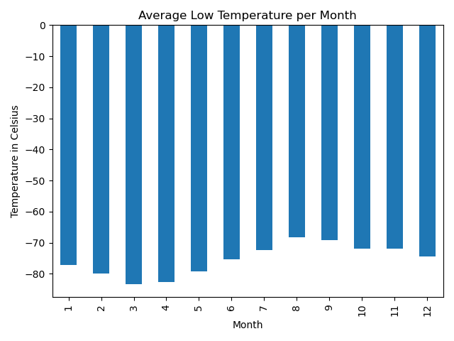
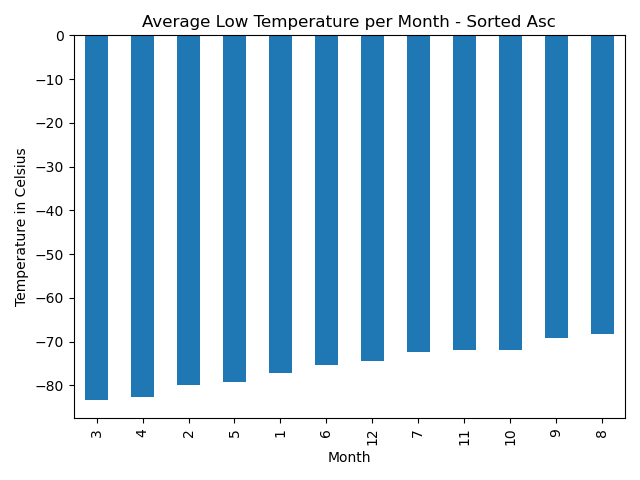
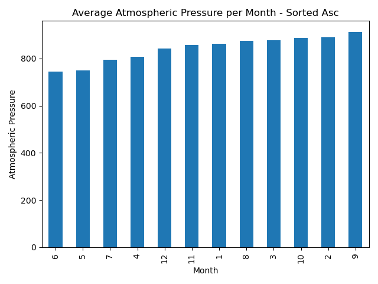
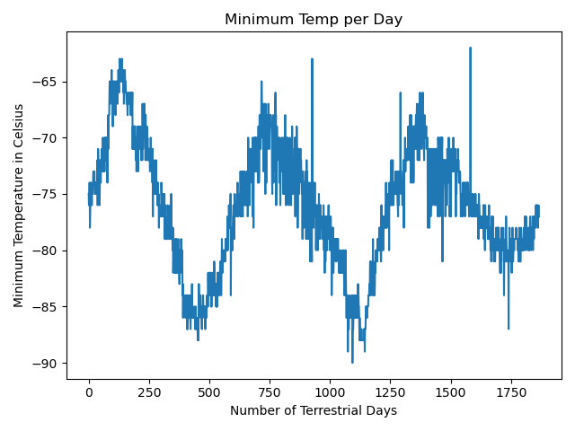

# web-scraping-challenge

### Scenario

Make use of the newly learnt skills of Web Scraping using the BeautifulSoup module to extract, organize, sort, analyize and visualize the data.  

This module is split into two parts:

- Scrape titles and preview text from Mars news articles
- Scrape and analyze Mars weather data, which exists in a table

------

### [Mars News Scrape](Mars_WebScraping/Mars_News/Mars_News_Scrape.ipynb)

Within a jupyter notebook, develop the code to extract the news articles on the main page:

- Use automated browsing to visit the [Mars news site](https://static.bc-edx.com/data/web/mars_news/index.html). Inspect the page to identify which elements to scrape.
- Create a Beautiful Soup object and use it to extract text elements from the website.
- Extract the titles and preview text of the news articles that you scraped. Store the scraping results in Python data structures as follows:
    - Store each title-and-preview pair in a Python dictionary and, give each dictionary two keys: title and preview.
    - Store all the dictionaries in a Python list.
    - Print the list in your notebook.
- Optionally, store the scraped data in a file (to ease sharing the data with others). To do so, export the scraped data to a JSON file.
    - My extracted JSON file can be found [here](Mars_WebScraping/Mars_News/Output_Files/mars_news.json).

------

### [Mars Weather Scrape](Mars_WebScraping/Mars_Weather/Mars_Weather_Scrape.ipynb)

Within a jupyter notebook, develop the code to extract the data from a table within a webpage. Create a Pandas DataFrame, analyze, visualize and output the data to a CSV file:

- Use automated browsing to visit the [Mars Temperature Data Site](https://static.bc-edx.com/data/web/mars_facts/temperature.html). Inspect the page to identify which elements to scrape.
- Create a Beautiful Soup object and use it to scrape the data in the HTML table.
- Assemble the scraped data into a Pandas DataFrame. The columns should have the same headings as the table on the website.
    - id: the identification number of a single transmission from the Curiosity rover
    - terrestrial_date: the date on Earth
    - sol: the number of elapsed sols (Martian days) since Curiosity landed on Mars
    - ls: the solar longitude
    - month: the Martian month
    - min_temp: the minimum temperature, in Celsius, of a single Martian day (sol)
    - pressure: The atmospheric pressure at Curiosity's location
- Examine the data types that are currently associated with each column. If necessary, cast (or convert) the data to the appropriate datetime, int, or float data types.
- Analyze your dataset by using Pandas functions to answer the following questions:
    - How many months exist on Mars?
    - How many Martian (and not Earth) days worth of data exist in the scraped dataset?
    - What are the coldest and the warmest months on Mars (at the location of Curiosity)? To answer this question:
        - Find the average minimum daily temperature for all of the months.
        - Plot the results as a bar chart.
    - Which months have the lowest and the highest atmospheric pressure on Mars? To answer this question:
        - Find the average daily atmospheric pressure of all the months.
        - Plot the results as a bar chart.
    - About how many terrestrial (Earth) days exist in a Martian year? To answer this question:
        - Consider how many days elapse on Earth in the time that Mars circles the Sun once.
        - Visually estimate the result by plotting the daily minimum temperature.
- Export the DataFrame to a CSV file.
    - My CSV file can be found [here](Mars_WebScraping/Mars_Weather/Output_Files/mars_data.csv).

### Mars Weather Analysis Plots

| Average Minimum Low Temp per Month | Average Minimum Low Temp per Month (Ascending) |
| ---------------------------------- | ---------------------------------------------- |
|  |  |

| Average Atmospheric Pressure per Month | Daily Minimum per Day |
| -------------------------------------- | --------------------- |
|  |  |

--------

## References

| Reference Name | Description |
|----------------|-------------|
| [The Mars News website](https://static.bc-edx.com/data/web/mars_news/index.html)  (Operated by edX Boot Camps LLC for education only) | The news article titles, summaries, dates, and images were scraped from [NASA's Mars News](https://mars.nasa.gov/) website in November 2022.  Images are used according to the [JPL Image Use Policy](https://www.jpl.nasa.gov/jpl-image-use-policy), courtesy NASA/JPL-Caltech. |
| [StackOverflow - JSON Extract](https://stackoverflow.com/a/26057360/21871037) | Code/Details on how to write a Python dict to a JSON file |

